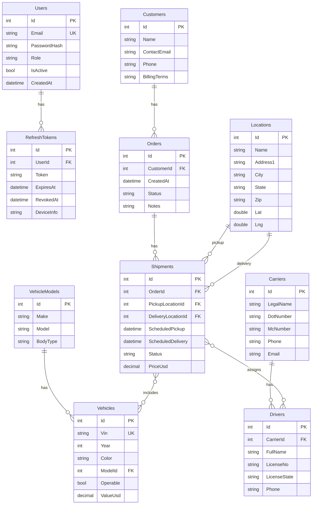

# ER Diagram (Explanation + Mermaid)

## Main Entities (tables)
- Users: Id, Email (unique), PasswordHash, Role (Admin|Dispatcher|Driver), IsActive, CreatedAt
- RefreshTokens: Id, UserId → Users.Id, Token, ExpiresAt, RevokedAt, DeviceInfo
- Customers: Id, Name, ContactEmail, Phone, BillingTerms
- Orders: Id, CustomerId → Customers.Id, CreatedAt, Status, Notes
- VehicleModels: Id, Make, Model, BodyType
- Vehicles: Id, Vin (unique), Year, Color, ModelId → VehicleModels.Id, Operable, ValueUsd
- Locations: Id, Name, Address1, City, State, Zip, Lat, Lng
- Carriers: Id, LegalName, DotNumber, McNumber, Phone, Email
- Drivers: Id, CarrierId → Carriers.Id, FullName, LicenseNo, LicenseState, Phone
- Shipments: Id, OrderId → Orders.Id, PickupLocationId → Locations.Id, DeliveryLocationId → Locations.Id, ScheduledPickup, ScheduledDelivery, Status, PriceUsd
- ShipmentVehicles (M:N): ShipmentId → Shipments.Id, VehicleId → Vehicles.Id (PK: ShipmentId+VehicleId)
- ShipmentDrivers (M:N): ShipmentId → Shipments.Id, DriverId → Drivers.Id, Role (PK: ShipmentId+DriverId)

## Mermaid ER Diagram

