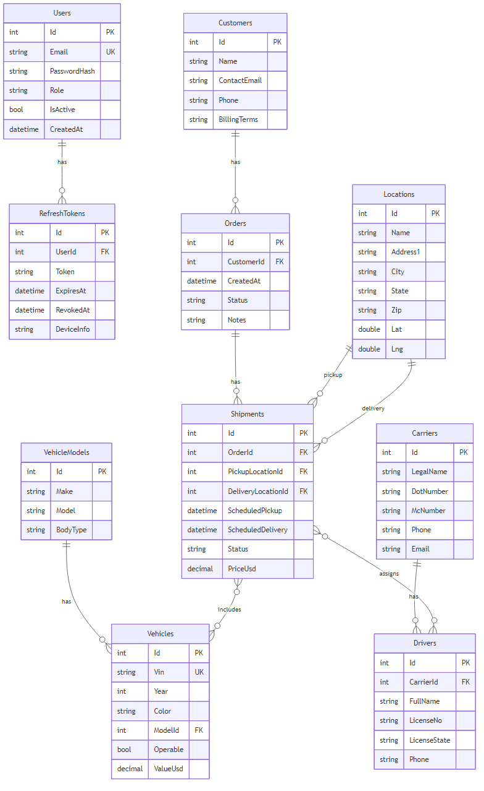

# USA Global Logistics
Project Overview & Pitch

- Problem & Solution
- Architecture & Tech
- Database (ERD)
- Security
- Local Runсд
- Value

---

## Problem

Small and medium logistics companies manage customers, orders, carriers, drivers, vehicles, and shipments across disparate tools/files:

- Manual data entry and duplication
- Poor traceability
- Hard planning & coordination

---

## Solution

A unified web system for logistics operations:

- Centralized database (customers, orders, locations, carriers, drivers, vehicles, shipments)
- CRUD UI + public API
- JWT auth with roles (Admin, Dispatcher, Driver)
- Shipment tracking with associated assets

---

## Architecture & Technologies

- Backend: ASP.NET Core (Minimal APIs), EF Core, SQLite, JWT
- Frontend: React + Vite + MUI, React Query, Axios
- Dev: CORS for http://localhost:5173, OpenAPI (Dev), Postman collection

---

## Security

- JWT Access Token + Refresh Token with rotation
- Role-based access (Admin, Dispatcher, Driver)
- Dev mode: relaxed issuer/audience/lifetime to stabilize UI

---

## ER Diagram (high level)

- Users 1—N RefreshTokens
- Customers 1—N Orders 1—N Shipments
- VehicleModels 1—N Vehicles
- Carriers 1—N Drivers
- Locations 1—N Shipments (pickup) and 1—N Shipments (delivery)
- Shipments N—M Vehicles (ShipmentVehicles)
- Shipments N—M Drivers (ShipmentDrivers)

---

## Local Run (Backend)

1) Install .NET SDK 10.0 (or downgrade to net9.0)
2) In USAGlobalLogistics.Api:

- dotnet dev-certs https --trust
- dotnet restore
- dotnet run --launch-profile https

Healthcheck: https://localhost:7083/health

---

## Local Run (Frontend)

1) Install Node.js 22.12+ (or 20.19+)
2) In usagl-ui:

- npm install
- set VITE_API_BASE_URL=https://localhost:5151
- npm run dev

Open: http://localhost:5173

---

## Value

- Consolidation of logistics data & processes
- Fewer errors and faster operations
- Visibility and traceability for shipments end-to-end

---

## Links

- docs/ProjectOverview.md (detailed)
- docs/ERD.md (ER diagram)
- docs/API_Endpoints.md (API reference)
